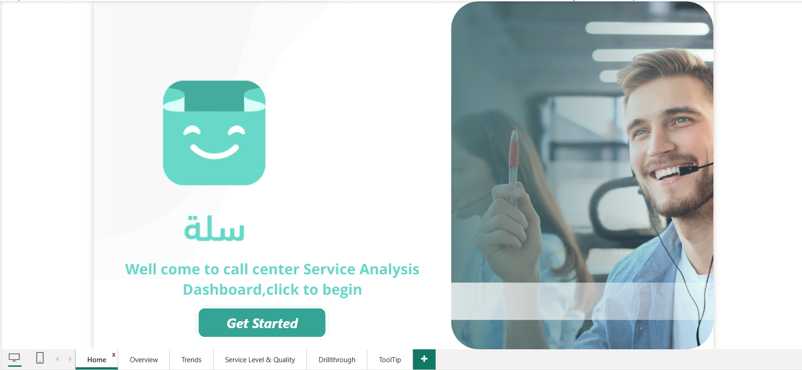
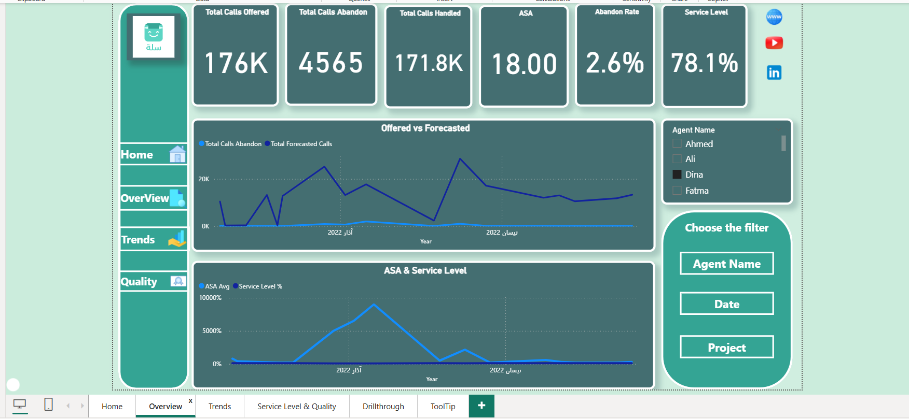
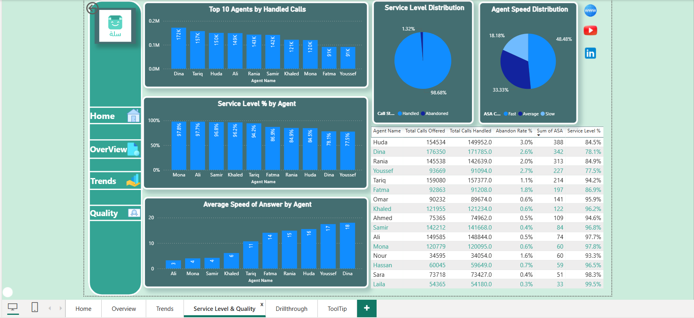
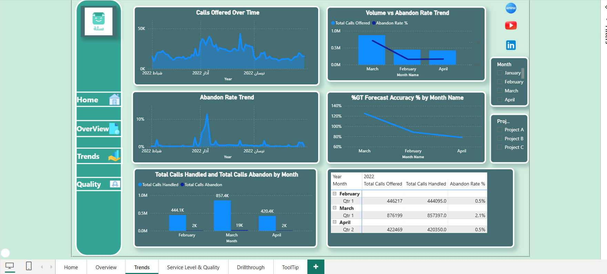

# Call Center Performance Analytics 📊

An interactive 4-page Power BI reporting system designed to monitor, analyze, and optimize call center operations and agent productivity.

##  Report Structure (4 Pages Deep Dive)

###  Executive Overview
* **Focus:** High-level summary of total calls, average handling time, and customer satisfaction.
* **Visual Preview:**

###  Agent Performance & Productivity
* **Focus:** Detailed metrics per agent, including call volume and occupancy rates to identify training needs.
* **Visual Preview:**

###  SLA & Operational Compliance
* **Focus:** Tracking response speed and adherence to Service Level Agreements (SLA).
* **Visual Preview:**

###  Trend Analysis & Forecasting
* **Focus:** Analyzing call spikes and historical trends to improve future resource planning.
* **Visual Preview:**

##  Technical Implementation
* **Power BI & DAX:** Created measures for dynamic KPIs and performance targets.
* **Data Modeling:** Built a star schema for efficient filtering and reporting.
* **ETL:** Cleaned and transformed raw call data using Power Query.

## 🔗 External Links
* [View Full Project on Behance](https://www.behance.net/gallery/240836281/Call-Center-Performance-Analytics-Dashboard)
